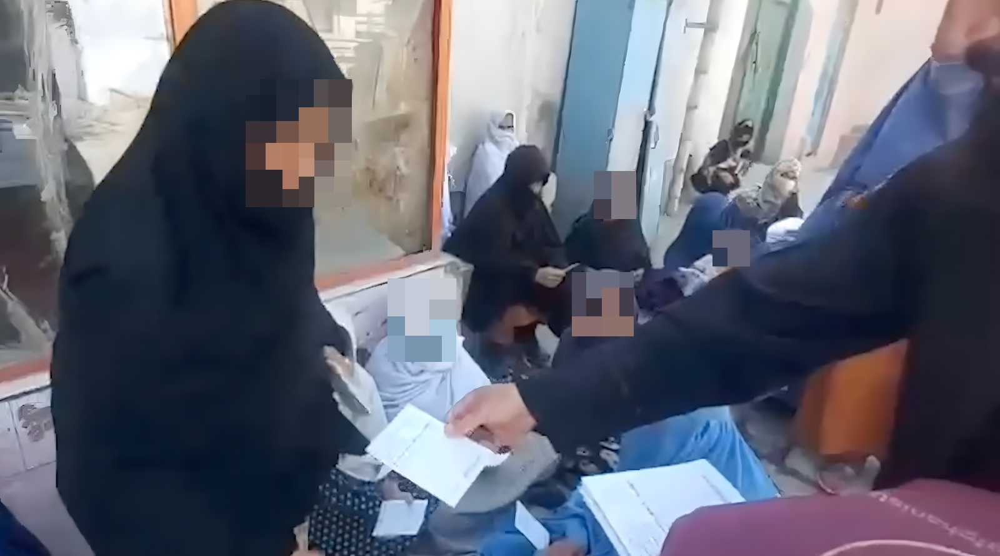
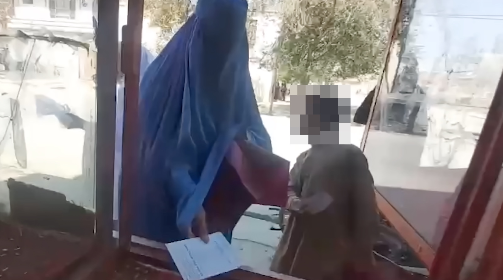
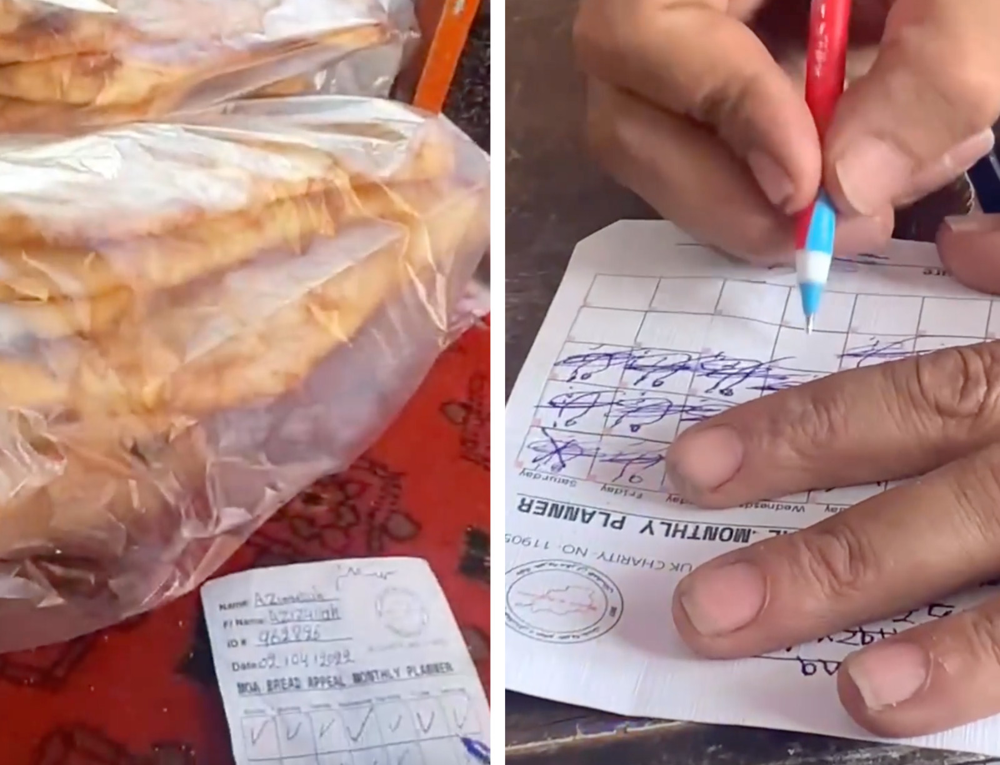
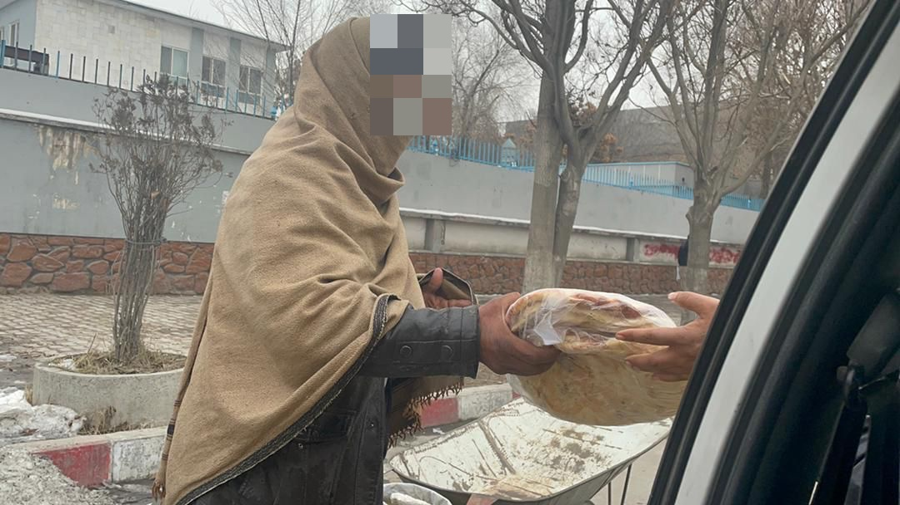

Over the last few months Mothers of Afghanistan have been facilitating daily bread distribution in Kabul, on behalf of Little Giving users. 

Mothers of Afghanistan is a UK registered charity ([1190531](https://register-of-charities.charitycommission.gov.uk/charity-search/-/charity-details/5152229/charity-overview)) that works in Kabul, Jalalabad, Paktika and other areas of Afghanistan. 

In Kabul, Mothers of Afghanistan have set up a bread voucher scheme for poor families and widows. Families are assessed and given vouchers which they can use to collect freshly baked bread from local bakeries. Currently 230 loaves are collected by families every day with donations from Little Giving users.

You can contribute to this project by selecting Mothers of Afghanistan as one of your charities on Little Giving.

Mothers of Afghanistan also operate a number of other projects in Afghanistan including building wells, distributing clothes, providing food packs, distributing cooked food (including aqiqah), and sponsoring orphans. They can be contacted at [mothersofafghanistan@hotmail.com](mailto:mothersofafghanistan@hotmail.com).

Little Giving is a free service that helps you give a few pence in sadaqah every day. We hand-pick causes that we would donate to ourselves and then work with those charities to facilitate small daily donations from our users.

---

Note: Faces have been blurred to preserve the dignity of recipients.