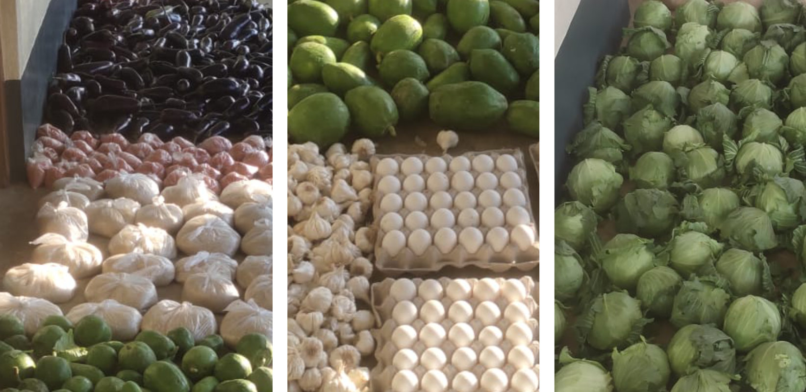

Charity Fatimah have set up a network for distributing a daily subsistence of vegetables in poor areas of West Bengal, to facilitate daily sadaqah on behalf of donors.

The trust based in Forest Gate, London, distributes vegetables across 60 villages in eight districts in West Bengal (Baduria, Matia, Basirhat, Swarupnagar, Deganga, Hasnabad, Hingalganj and Gaighata). A network of local maktabs (elementary schools for learning to read the Quran) sort the vegetables and help facilitate door-to-door distribution.

Many of the villagers subsist on less than 25p a day and live in makeshift wood and straw huts. Currently 550 families receive vegetables every day. About 20% of that is through donations from Little Giving users.

Charity Fatimah also work in rural areas of Rajasthan, Bihar and Assam, distributing cooked food (including aqiqah), clothes, blankets (during the winter) and tarpaulin (during the rainy season). You can contribute to their daily vegetable project by selecting Charity Fatimah as one of the charities you give to on Little Giving.

Little Giving is a free service that helps you give a few pence in sadaqah every day. We hand-pick causes that we would donate to ourselves and then work with those charities to facilitate small daily donations from our users. See our [FAQs](https://www.littlegiving.org/support) for more details.

---

Note: Faces have been blurred to preserve the dignity of recipients.