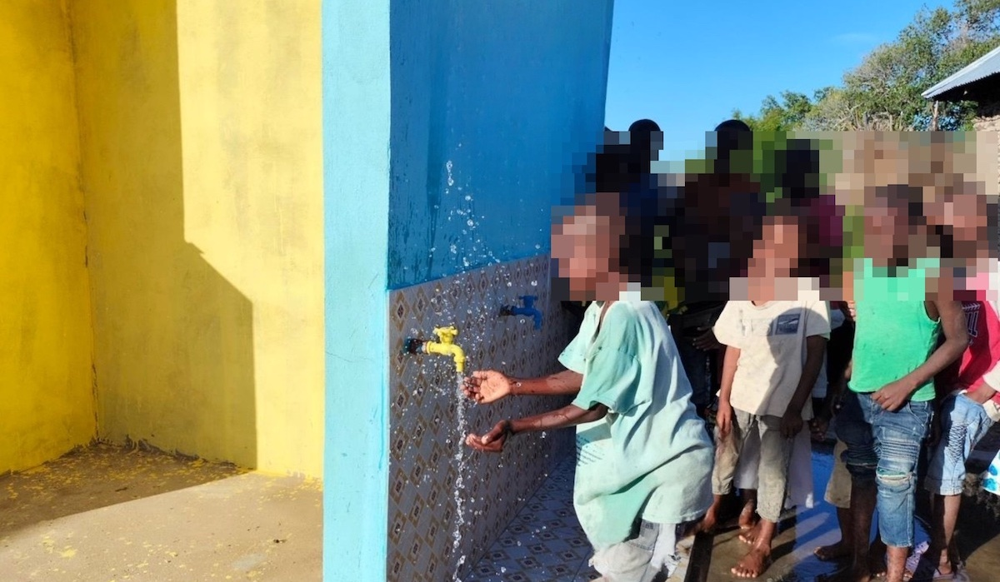

Waterfall have drilled a borehole and installed a pump and filter system to supply Helani Village in Tanzania with clean water, on behalf of Little Giving users.

Helani is a rural village located in Tanga, eight hours drive from Dar es Salaam. About 500 households (2,000 people) benefit from the installation. The system can supply 10,000 litres of water a day and is built to last at least 20 years. A local company has been contracted to maintain the installation.

Members from Waterfall's UK office traveled to Tanzania to oversee the work.

Before the well was installed, women would collect water from riverbeds and ponds. When water couldn't be found or the quality was very poor, women would have to walk for miles to source useable water. The typical household income in Helani is £300 a year (about 80p a day). 

You can contribute to clean water projects by selecting Waterfall as one of your charities on Little Giving.

Waterfall is a charity based in Leicester ([1140634](https://register-of-charities.charitycommission.gov.uk/charity-search/-/charity-details/5016027)), that works in Tanzania. They dig and maintain boreholes, water pumps and build facilities for sanitation. They also distribute food and sponsor a number of locally run schools. They can be contacted at [info@waterfallcharity.org](mailto:info@waterfallcharity.org).

Little Giving is a free service that helps you give a few pence in sadaqah every day. We hand-pick causes that we would donate to ourselves and then work with those charities to facilitate small daily donations from our users. See our [FAQs](https://www.littlegiving.org/support) for more information about how we work.

---

Note: Faces have been blurred to preserve the dignity of recipients.